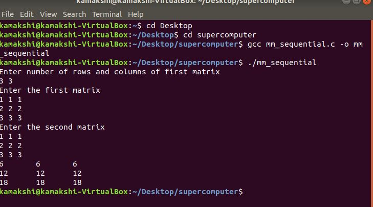
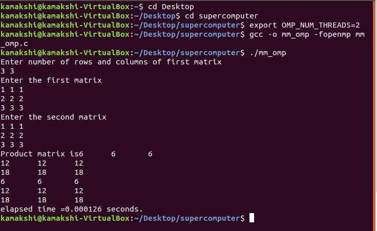
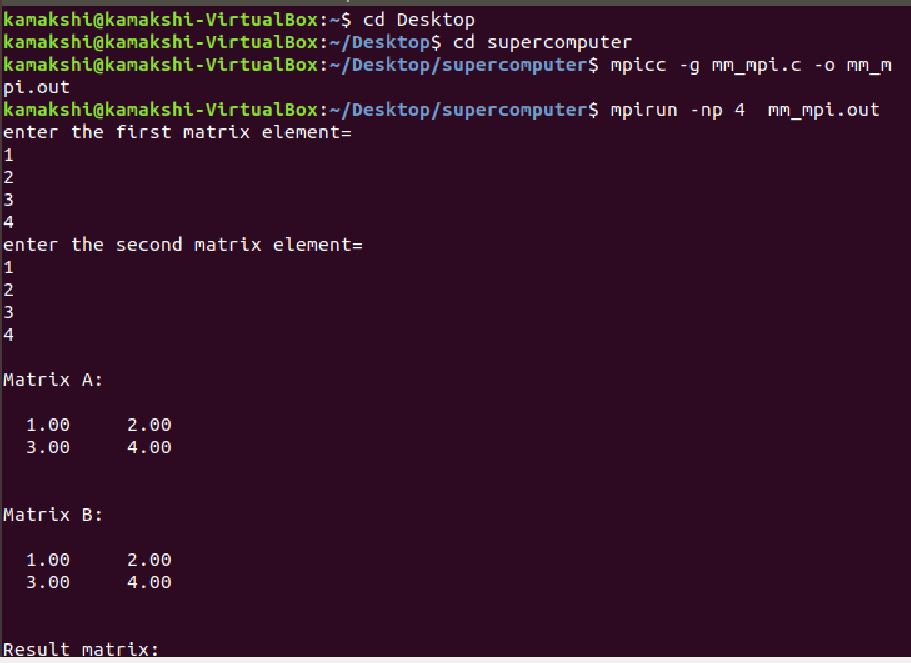
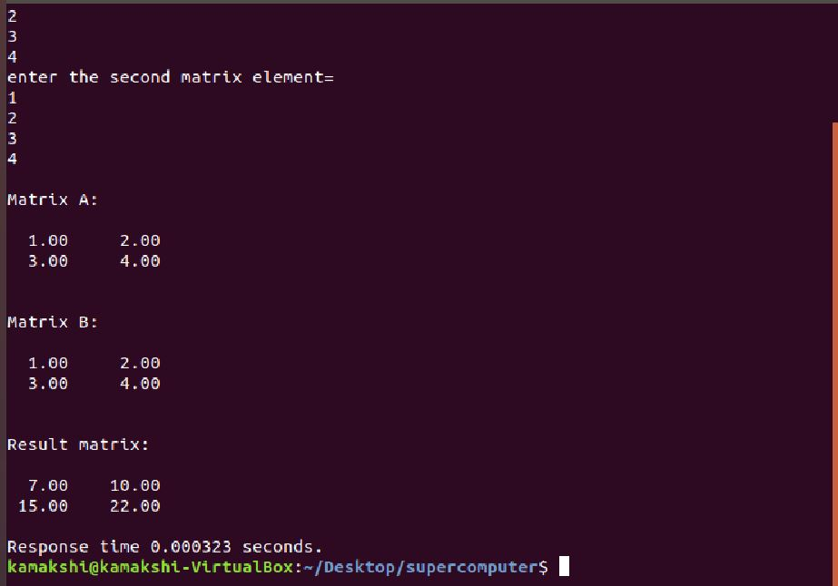

# One-credit-course-assignment
<h1>Assignment 1 - Sequential Matix Multiplication</h1>
This is sequential matrix multiplication using c program.

Execution and output in linux terminal using gcc compiler.

This is openmp matrix multiplication using c program.

Execution and output in linux terminal using gcc compiler.

This is mpi matrix multiplication using c program.

Execution and output in linux terminal using gcc compiler.

